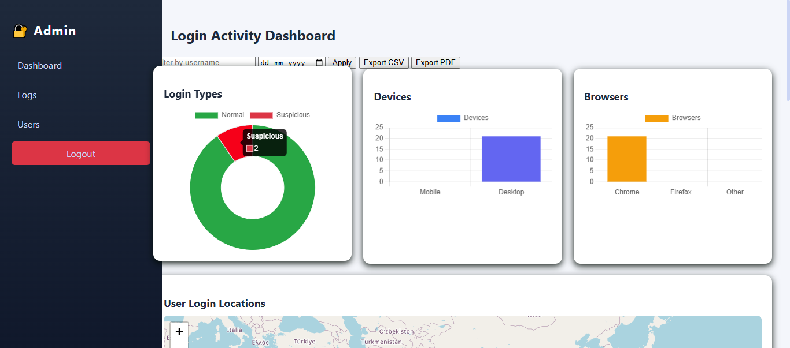
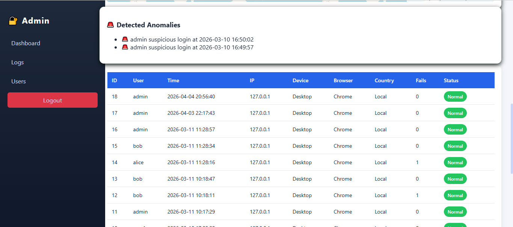
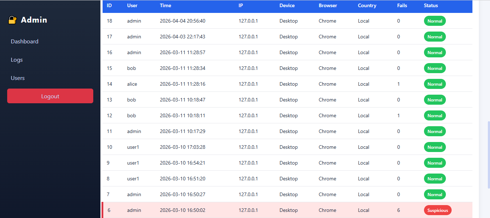

# Login Anomaly Detection System

This system uses a supervised machine learning pipeline to classify login attempts as normal or anomalous, simulating detection workflows used in Security Operations Centers (SOC).

### Algorithms & Techniques Used
- Logistic Regression
- Random Forest Classifier
- SMOTE (Synthetic Minority Oversampling Technique)
- StandardScaler (Feature Scaling)

### Pipeline Overview

#### 1. Data Preprocessing
- Extracted time-based features (e.g., login hour)
- Encoded categorical variables
- Applied **StandardScaler** to normalize numerical features

#### 2. Handling Class Imbalance (SMOTE)
- Login anomaly datasets are highly imbalanced
- Applied SMOTE to generate synthetic anomalous samples
- Improved model’s ability to detect rare suspicious events

#### 3. Model Training

**Logistic Regression**
- Used as a baseline model
- Provides interpretable results
- Helps understand feature influence on predictions

**Random Forest Classifier**
- Used as the primary model
- Captures complex behavioral patterns
- Provides higher accuracy for anomaly classification

### Why This Approach?

- **StandardScaler**
  - Ensures features are on the same scale
  - Improves performance of Logistic Regression

- **SMOTE**
  - Addresses class imbalance
  - Improves recall for anomaly detection

- **Logistic Regression**
  - Simple, interpretable baseline
  - Useful for comparison

- **Random Forest**
  - Robust and accurate for structured data
  - Handles non-linear relationships effectively

### Detection Logic

The system flags a login as suspicious based on:
- Unusual login time (e.g., late night activity)
- New or unknown IP address
- Deviation from user’s normal behavior

### Output Interpretation

- Each login attempt is classified as:
  - **Normal**
  - **Anomalous (Potential Threat)**

- (Optional if implemented):
  - Probability score indicating likelihood of anomaly

### Example Detection

Input:
- Login at 02:45 AM  
- New IP address detected  

Output:
- **Risk Level: HIGH**
- **Reason:**
  - Unusual login time  
  - Suspicious IP change  

### Objectives

This project demonstrates:
- Behavioral anomaly detection  
- Handling imbalanced security data  
- Application of ML in threat detection  
- Simulation of SOC monitoring workflows
  
## Features
- Time-based anomaly detection (odd-hour logins)
- IP-based anomaly detection
- Synthetic dataset generation for realistic scenarios
- Machine learning model for anomaly detection
- Web interface using Flask

## Tech Stack

- **Backend:** Flask  
- **Machine Learning:** Scikit-learn (Random Forest), Imbalanced-learn (SMOTE)  
- **Data Processing:** Pandas, NumPy  
- **Visualization/UI:** HTML, CSS  
- **Dataset:** Synthetic login activity dataset  

## Project Structure
login-anomaly-detection/
│
├── app.py # Main Flask application
├── requirements.txt # Dependencies
│
├── ml/ # Machine learning modules
│ ├── train_model.py
| ├── evaluate_models.py
│ ├── preprocessing.py
│
├── templates/ # HTML templates
├── static/ # CSS, JS files
│
├── data/ # Dataset
│ └── login_sample_1000.csv

## Dataset
A synthetic dataset is used to simulate login behavior:
- Timestamp
- User ID
- IP Address
- Device / Location (if applicable)

Anomalies include:
- Unusual login times
- Suspicious IP changes
- Rapid login attempts

## Installation

```bash
git clone https://github.com/yourusername/login-anomaly-detection.git
cd login-anomaly-detection
pip install -r requirements.txt
```

## Interface Preview

### Login Page


### Home Page


### Detection Result



## Usage

```bash
python app.py
```

Then open in browser:
[http://127.0.0.1:5000/](http://127.0.0.1:5000/)

## Model Training

```bash
python ml/train_model.py
```

## Security Relevance (SOC Perspective)

This project demonstrates:

* Behavioral anomaly detection
* Threat identification logic
* Practical application of ML in cybersecurity
* Understanding of login-based attack patterns

## Limitations

* Uses synthetic dataset
* Not production-scale
* Limited feature engineering

## Future Improvements

* Integrate real-world datasets
* Add risk scoring system
* Implement real-time alerting
* Improve feature engineering

## Real-World Application

This system can be applied in:
- Security Operations Centers (SOC)
- Fraud detection systems
- User behavior analytics (UBA)
- Insider threat detection
  
## Academic Context

This project was developed as part of a 3rd semester MCA mini-project, with a focus on applying machine learning techniques to cybersecurity use cases such as login anomaly detection.

## Note

Large datasets and trained model files are excluded for efficiency.
The model can be retrained using the provided scripts.

